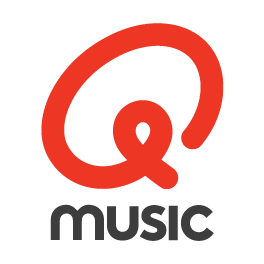

# 📻 DPG Media Radio

Hi! We are the software engineering team behind all radio stations of **DPG Media** — rocking the airwaves in both 🇳🇱 **the Netherlands** and 🇧🇪 **Belgium**:

  
  
  

We craft the digital experiences that keep our listeners connected to their favourite music and shows:

- 🌐 **Sites & Apps** — The web and mobile experiences our listeners use every day
- 📻 **Dario** — Our broadcast management and editorial system that keeps shows running smoothly
- 📺 **Muxo** — Visual orchestration software for visual radio, screens and lighting
- 🛠️ **Broadcast Tooling** — All kinds of tooling that built around the hardware and software of our radio studios

## 💼 Join Our Team!

Love radio? Love music? Love code? **We're hiring!**

We're looking for passionate engineers who want to build the future of radio — come make some noise with us! 🎸

👉 [Software Engineer Broadcast Systems](https://vacatures.dpgmedia.nl/o/software-engineer-broadcast-systems-qmusic-joe-willy)  
👉 [Senior Fullstack Developer](https://vacatures.dpgmedia.nl/o/senior-fullstack-developer-qmusic-joe-willy)
